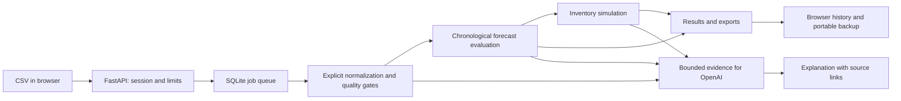

# Architecture and data contract

One Python process serves the built React frontend and executes one queued analysis at a time. Ownership comes from an anonymous HttpOnly cookie. Jobs, source files, plans and chat messages are scoped to that owner. No login is needed. This architecture must not be scaled horizontally without replacing the local queue/database design.

## Required daily sales meanings

| Field | Meaning |
|---|---|
| date | Store-local sales day; date order and timezone are explicitly confirmed |
| product_id | Exact identifier, preserving leading zeroes |
| product_name | Optional display name; renamed products need confirmation |
| units_sold | Nonnegative whole gross completed sales units; net revenue is not accepted |
| date_status | Optional observed/closed/stockout information, using supported import labels |

Transaction exports additionally use event identity/type. Returns and cancellations are classified separately. Wide files have one product per row and date columns. An unknown or missing date is not silently converted to zero.

Coverage files specify product_id, active_from, active_to. Daily status files explain particular product dates. Stock files provide product_id, available_units, as_of_date, lead_time_days, pack_size, minimum_order_units. Incoming files use incoming_line_id, product_id, due_date, incoming_units, status. Download the app's templates for exact headers and accepted values.

## AI boundary

Column suggestions send headers only and require review. Chat sends bounded selected-product evidence, recent messages and, when requested, at most 31 days of normalized records. A preview is recomputed on the server from validated assumptions. The assistant cannot execute code, query arbitrary SQL, change source records, apply a scenario or place an order. Applying a plan remains an explicit user action.

## Free hosting and recovery

The free profile allows 2 MiB, 50,000 source rows, 100 products and 50,000 product-days. Server state is temporary and may disappear during sleep/recreation. Results in IndexedDB and downloaded workspace files are independent of server storage. Restored results are inspectable, not proof of authentic computation; recalculation requires re-uploading the source.

## Statistical limits

Forecasts estimate observed sales under the confirmed coverage assumptions. They do not recover hidden demand during stockouts. Model selection, calibration (where enough history exists), and the final historical test use separate periods. Historical WAPE is an error ratio and can exceed 100%. The inventory safeguard is provisional, not a service-level guarantee. See README and evidence for poor real-data outcomes as well as synthetic examples.
