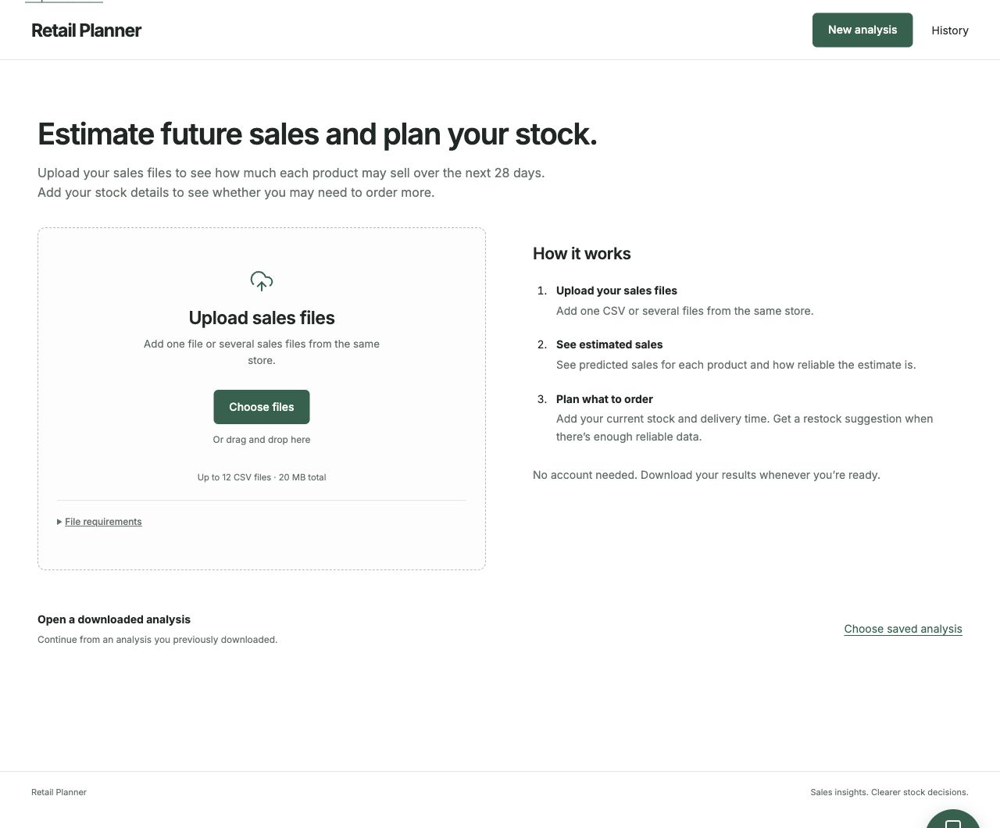

# Retail Planner

Turning sales records into a clearer plan for what to stock next.

[Open the app](https://retail-planner-demo.onrender.com/) · [My portfolio](https://shashankpabitwar123.github.io/Portfolio/#retail-planner)

**How can a store use its past sales to decide what to order next?**

I built Retail Planner to connect three parts of that decision: checking the sales records, estimating demand, and understanding how stock levels and delivery times affect the next order. The result is an app that takes CSV files and produces a 28-day sales forecast with a downloadable restock plan when the information supports one.

## How the project came together

### 1. Start with reliable sales records

I built a Python workflow to read different sales-file layouts, check dates and product IDs, and identify missing or conflicting records. Missing days stay separate from days with zero sales, so the forecast does not start with an unsupported assumption.

### 2. Compare forecasts before choosing one

I compared six forecasting methods against earlier sales periods, then checked the selected method on a separate 28-day period. The app shows historical error alongside the forecast so users can judge how much confidence to place in it.

### 3. Connect the forecast to a stock decision

Users add current stock, incoming deliveries and lead times to explore a restock plan. I made the assumptions editable and the results downloadable, so someone can review the numbers before making a purchasing decision.

### 4. Make the analysis easy to use

I brought the workflow into a React interface with a FastAPI backend and SQLite storage. Users can upload files, review forecasts, compare stock scenarios and save their analysis without creating an account.

## The project in numbers

| Measure | Result |
|---|---|
| Records processed in one live performance check | **200,000** |
| Products in that run | **100** |
| Uploaded file size | **19.69 MB** |
| Combined server processing time | **3 min 35 sec** |
| Forecasting methods compared | **6** |
| Forecast horizon | **28 days** |

The processing figures come from one controlled run. They exclude user input time and browser rendering; speed varies with the file and hosting conditions.

## What I learned

A useful analysis needs to explain when its answer is uncertain. I made data-quality checks and forecast error visible, and withheld restock suggestions when the information or historical performance did not support them. The app helps someone review a decision; it does not place orders.

## What I used

| Tool | Role |
|---|---|
| **Python** | Data preparation, forecast comparison and inventory calculations |
| **SQL / SQLite** | Store uploads, analysis jobs and saved results |
| **FastAPI** | Connect the analysis workflow to the app |
| **React / TypeScript** | Build the upload, forecast and inventory views |
| **OpenAI API** | Optional explanations of analysis results |
| **Docker / Render** | Package and host the application |

## Explore the work

- [Try Retail Planner](https://retail-planner-demo.onrender.com/)
- [Read the analysis code](backend/domain.py)
- [See how the app fits together](docs/architecture.md)
- [Run it locally](docs/setup.md)
